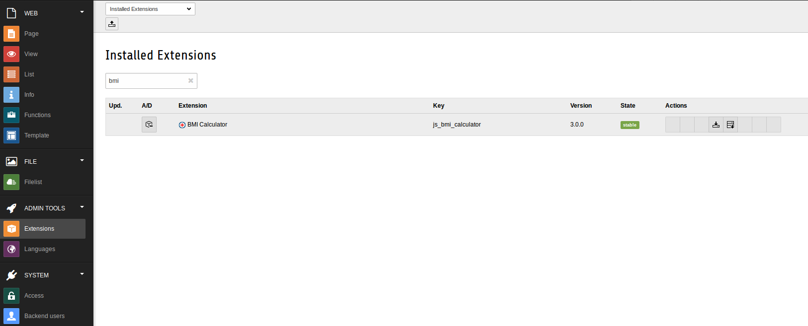
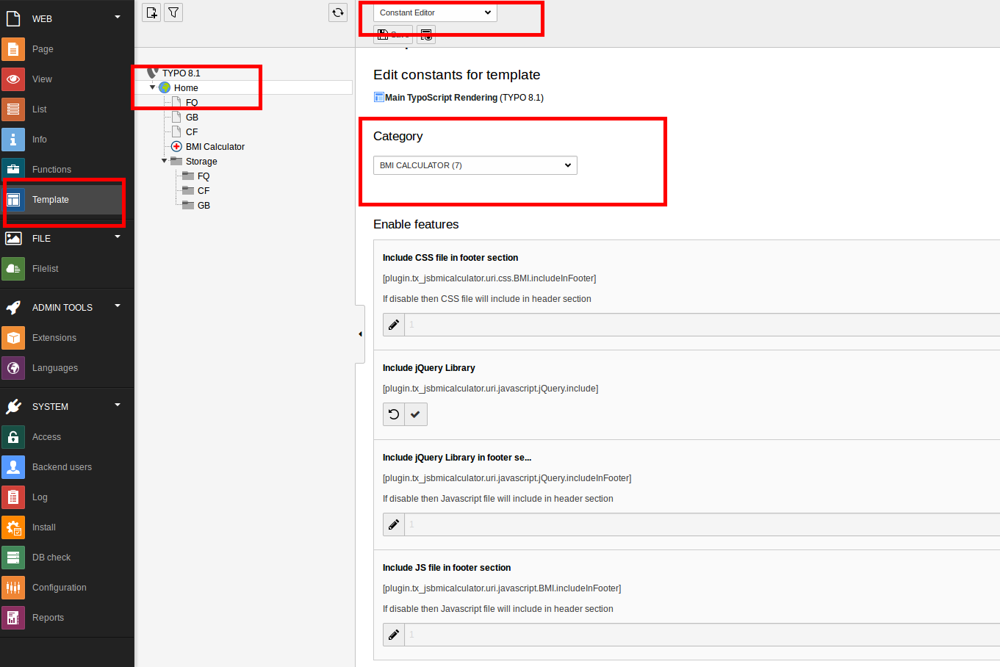
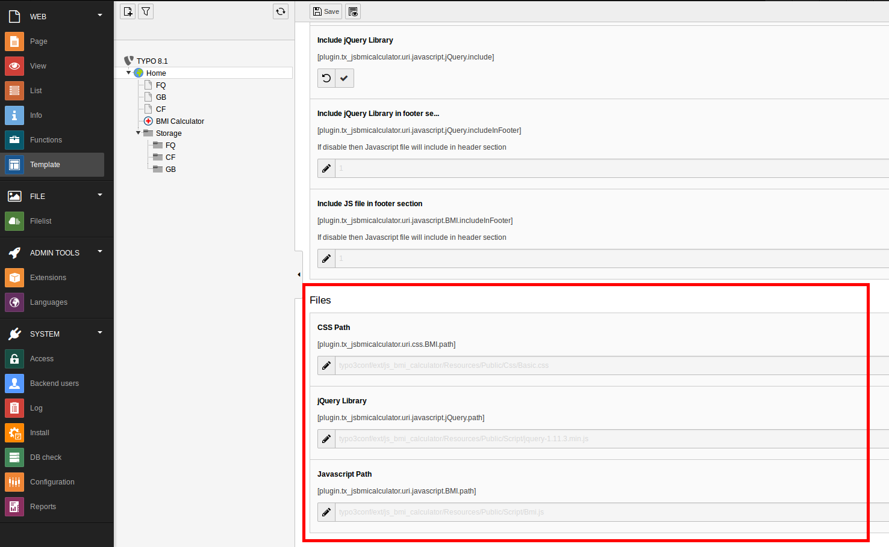

.. ==================================================
.. FOR YOUR INFORMATION
.. --------------------------------------------------
.. -*- coding: utf-8 -*- with BOM.

.. include:: ../Includes.txt

.. _admin-manual:

Administrator Manual
====================

Target group: **Administrators**

The body mass index (BMI) or Quetelet index is a value derived from the mass (weight) and height of an individual.

.. _admin-installation:

Installation
------------

To install the extension, perform the following steps:

#. Go to the Extension Manager
#. Install the extension
#. Load the static template
#. ...

   Installed BMI Calculator

BMI Calculator : Typoscript configuration : Enable Features

   Typoscript configuration : Enable Features

BMI Calculator : Typoscript configuration : Manage Javascript and CSS file path

   Typoscript configuration : Manage Javascript and CSS file path