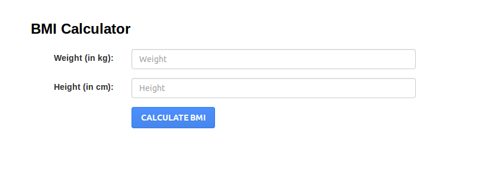
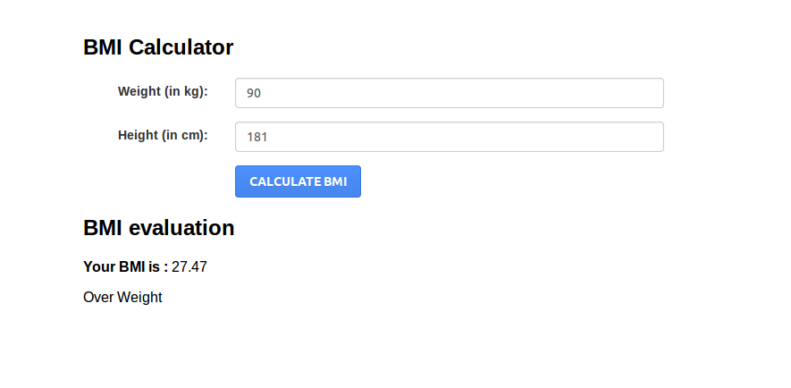
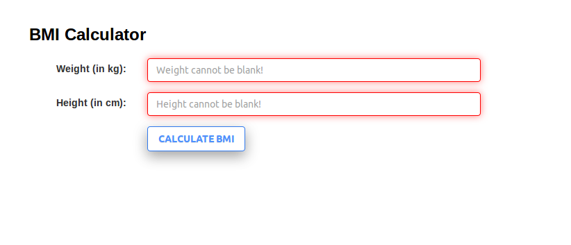
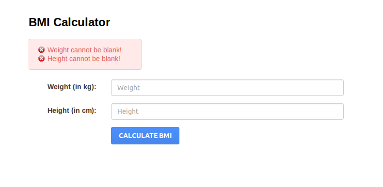

.. ==================================================
.. FOR YOUR INFORMATION
.. --------------------------------------------------
.. -*- coding: utf-8 -*- with BOM.

.. include:: ../Includes.txt

.. _introduction:

Introduction
============

The body mass index (BMI) or Quetelet index is a value derived from the mass (weight) and height of an individual.

.. important::

   Please don't forget include your jQuery library if not included in your project

.. _screenshots:

Screenshots
-----------

How the extension works in frontend

   BMI Calculator 

BMI Calculator Result

   BMI Calculator Result

BMI Calculator Client side Validation

   BMI Calculator Client Side Validation

BMI Calculator Result

   BMI Calculator Client Side Validation

