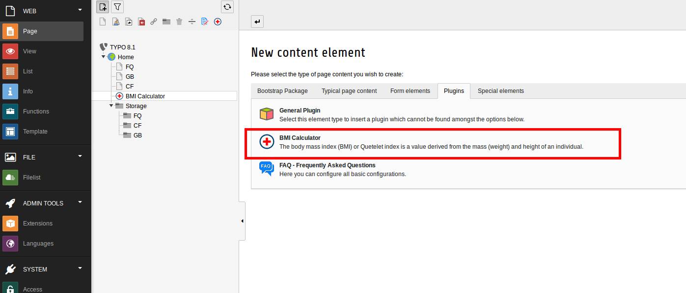
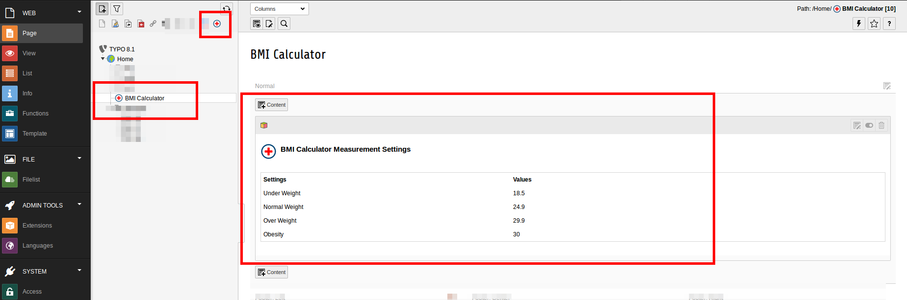

.. ==================================================
.. FOR YOUR INFORMATION
.. --------------------------------------------------
.. -*- coding: utf-8 -*- with BOM.

.. include:: ../Includes.txt

.. _user-manual:

Users Manual
============

Target group: **Editors**

Here should be described how to use the extension from the editor perspective.

.. tip::

   Simple configure your plugin.

   Plugin Configuration of BMI Calculator